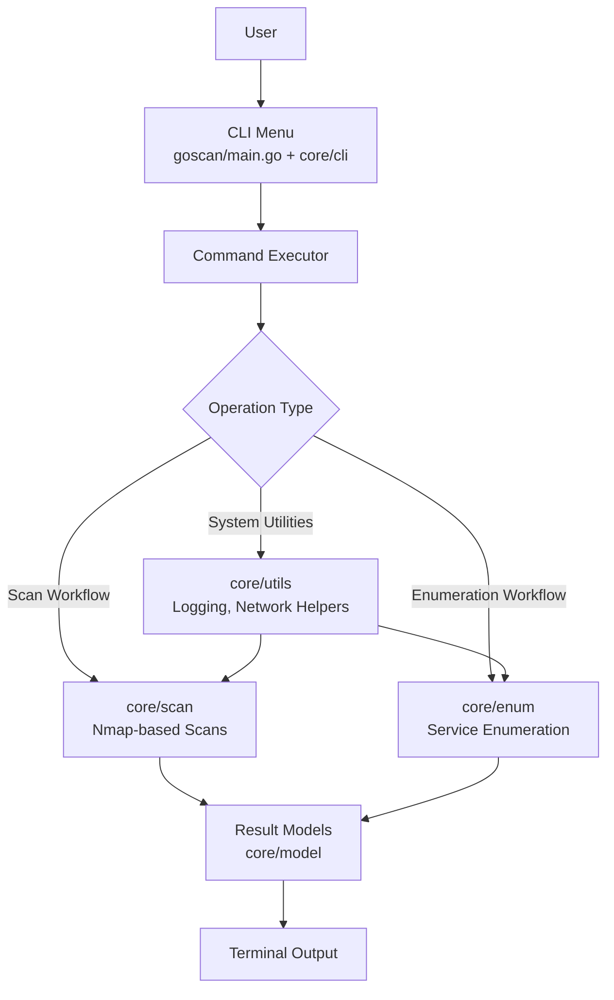

# GoScan-Advance-Network-Scanner-Using-Nmap

GoScan - Advance Netwek Scanner Using Nmap

## Description / Overview

Advance Network Scanner is a command-line network assessment tool written in Go and powered by Nmap. It provides a structured menu-driven workflow for host discovery, port analysis, and service enumeration, making it practical for day-to-day security checks and lab environments.

## Features

- Menu-based scan execution for common network and security tasks
- Integrated Nmap workflows for host discovery, port scanning, and service detection
- Enumeration modules for protocols and services such as DNS, HTTP, FTP, SSH, SMB, SNMP, SMTP, RDP, and SQL
- Cross-platform support for Windows, Linux, and macOS
- Optional containerized execution through Docker Compose

## Tech Stack

- Language: Go
- Core scanning engine: Nmap
- Build tooling: Go modules and Makefile
- Container support: Docker, Docker Compose
- Optional local persistence: SQLite (platform-dependent build path)

## Architecture / System Design

The runtime follows a layered CLI-to-engine flow, where scan requests are handled centrally and delegated to scan and enumeration modules.



## Installation & Setup

### Prerequisites

- Go (1.21 or newer recommended)
- Nmap (installed and available in PATH)
- Git

### Clone

```bash
git clone https://github.com/suvadityaroy/Advance-Network-Scanner-Using-Nmap.git
cd Advance-Network-Scanner-Using-Nmap/goscan
```

### Build

```bash
go build -o goscan main.go
```

Windows build:

```powershell
go build -o goscan.exe main.go
```

### Run

```bash
./goscan
```

Windows run (PowerShell):

```powershell
.\goscan.exe
```

### Docker (optional)

From the repository root:

```bash
docker compose up --build
```

## Author / Contact

Suvaditya Roy

GitHub: https://github.com/suvadityaroy
